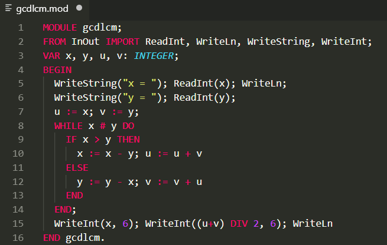
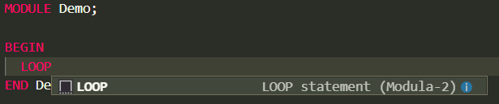

Modula-2 syntax highlighting and snippets for Visual Studio Code
================================================================

This extension provides syntax highlihting and snippets for Modula-2.

## Features

* Syntax highlighting

* Snippets

## Known Issues

* Supports only PIM4.

* Snippet collection is very small.

## Release Notes

### 1.0.0

Initial release of [m2-vscode](https://github.com/redstar/m2-vscode).

Features syntax highlighting and snippets for the Modula-2 programming language.
